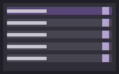

# Setup

Only one thing is required: a **memory model**. Everything else is optional, and the story plays without it.

| Piece | Needed for | Page |
|---|---|---|
| Memory model (a Connection Manager profile) | The story moving on its own, memory, summaries | [Memory model](memory-model.md) |
| A model for each job | Better results: a prose model for replies, a strict one for reads, a tool-calling one for the wizard | [Choosing models](models.md) |
| Judge plugin + a TypeSafe key | Faster, more careful choices: speaker picks, lore selection, memory checks, scene tracking | [Judge](judge.md) |
| An image service | Illustrations and sprites | [Illustrations](images.md), [Sprites](sprites.md) |
| GPU plugin | A local text model and local images sharing one graphics card | [One GPU for text and images](gpu-sharing.md) |
| Harness plugin | Running tasks through Claude Code, Codex or opencode logins on the server | [Harness](harness.md) |

## The settings panel

Every setting is in **Extensions → Story Orchestrator**, below **Start / Continue / Repair / Author**, in one section
per area. Each section's **?** opens its page in this guide, and rarely changed settings sit under its **Advanced**
fold. A section's title says its scope: "this install" settings affect every chat, "this chat" only the open one.



- **Playing**: which story this chat plays, the story bar, notes under messages, the briefing, list marks, pacing.
- **Memory**: the memory model, its fallback, reply thinking, the memory model test, models per task, chapters, the
  continuity warden (Author view).
- **Characters**: several voices per turn.
- **World**: how story lorebooks switch on, and the lorebook curator (Author view, or before a story is loaded).
- **Images**: illustrations and the sprite stage.
- **Judge**: the key, the switch, and what it is used for.
- **Authoring**: the wizard switch (Author view, or before a story is loaded).
- **Setup**: **Host capabilities** says which SillyTavern features the extension found, and **Copy for a bug
  report** copies the whole picture.

Every setting, its default and its key: [Settings reference](settings-reference.md).

## Install

There is no published release yet. Build from the source: clone the repository anywhere **outside** SillyTavern, then

```bash
echo <SillyTavern root> > .st-root     # or set ST_ROOT; the build records hashes of SillyTavern's files
npm ci
npm run build
npm run stage
```

`dist/` is not in the repository, so the build is not optional. `stage` copies exactly the files a release would ship
into `<SillyTavern>/public/scripts/extensions/third-party/story-orchestrator` (and refuses a folder that holds a source
checkout). Reload SillyTavern; the panel appears under **Extensions → Story Orchestrator**. To update, pull, then run
the last three commands again.

`npm run package` builds a release zip from a clean checkout. Unzip it so its `story-orchestrator/` folder lands in
SillyTavern's `public/scripts/extensions/third-party/`.

## Server plugins

Four server plugins ship in `server-plugin/`: judge, and the optional GPU, media and harness plugins. SillyTavern loads
server plugins only when `config.yaml` has `enableServerPlugins: true`, and only after a restart.

- **From a source checkout**: `npm run plugin:install -- --st-root <SillyTavern>` installs the judge plugin, and
  `--with gpu,media,harness` adds the others. A plugin already installed is kept in sync. Files are compared by
  content, never by version, and a local `config.json` is never touched; `--check` lists the files that differ without
  writing. It warns when `enableServerPlugins` is off.
- **From a release zip**: copy each plugin folder you want from `story-orchestrator/server-plugin/<name>/` to
  `<SillyTavern>/plugins/<name>/`.

Install only the plugins you need. The GPU plugin is for one specific machine setup; see
[Illustrations](images.md).

## Tested on

The extension is exercised against one host at a time; this is the one it was last exercised on. The models are in
[Choosing models](models.md#what-we-tested-on).

| | |
|---|---|
| SillyTavern (live play) | 1.19.0, commit `7c399419636c4df3d6d035fcddf9ccbb8248b432` (`host.commit` in `dist/manifest.json`) |
| SillyTavern (clean install) | 1.19.0, commit `06bde939fb1e9c4c8d8641d810f0a916b5bce127` (`release`, cloned clean): machine gates only, no live play |
| Declared older host | 1.18.0 (`minimum_client_version`), commit `51ad27fb86d39a3daca3adaa970375c9670c12df`: typecheck, lint, test, build and release tests green; not played through |
| Browser | Chromium, desktop and a 390×844 phone viewport |

**Not tested on other SillyTavern versions.** The extension imports SillyTavern modules by path and hashes them at
build time, so a version whose files differ is one nobody has run it against. **Setup → Host capabilities** reports
each feature it probes (`macros`, `slashCommands`, `backgrounds`, `vectors`, `judge`) as present, absent or error.

---

[Guide](../README.md)
