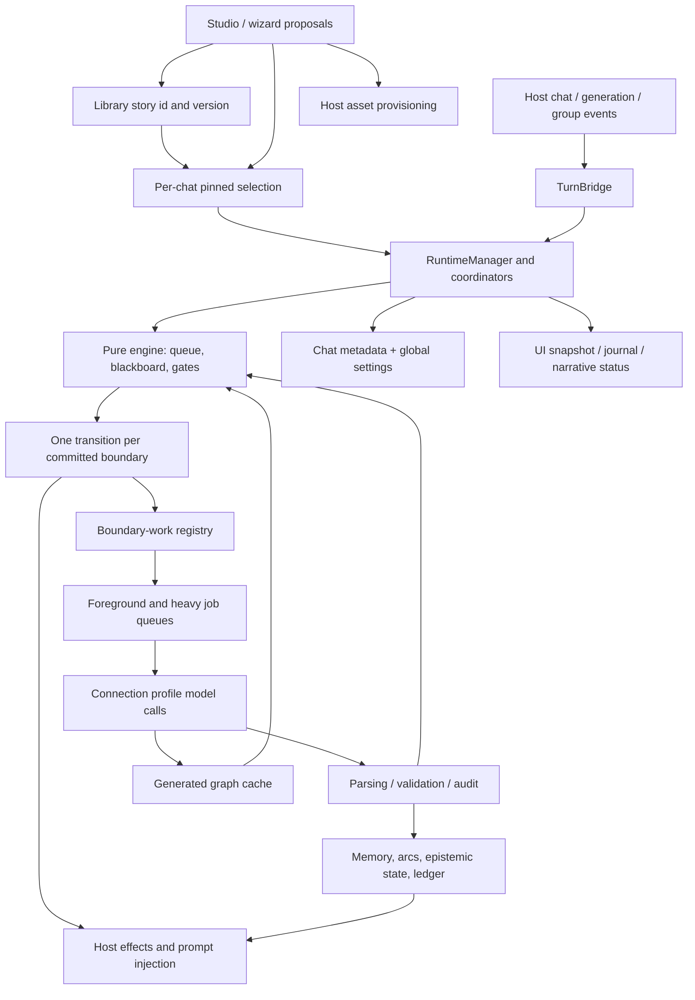

# Architecture, evolution and design assessment

## Purpose and evolution

The product is a direction layer for SillyTavern roleplay: authored checkpoints provide a dependable plot spine; model reads infer what happened; memory and pacing steer narration; optional generation fills the distance between authored anchors. Player mode should make this feel like a continuing story. Author mode exposes the graph, requirements, state and corrective controls.

The [Git history](evidence/history.txt) shows an October 2025 build foundation, February 2026 UI and AI-loop work, March rework, then a July v2 implementation sequence. February fixes already concerned per-chat roadmaps, story binding, expansion identity and turn deduplication. These are recurring lifecycle problems, not new concerns introduced solely by Stagecraft.

The July v2 specification made a substantive design change: fuzzy interpretation proposes typed state changes; deterministic gates, latches and priorities decide transitions at boundaries. Its plans added extraction, background scaffolding, memory, pacing, cast and authoring in layers. The August v2.1 overview explicitly acknowledges that per-feature gates missed composition. It introduced stable story identity, global versus per-chat settings, player/author separation, coordinator decomposition, a wizard, and journey-based acceptance. HEAD covers v2.1 through plan 06; the reviewed dirty tree includes Stagecraft and further acceptance work.

Relevant intent sources are `docs/plans/v2/story-orchestrator-spec-v2.md`, `docs/plans/v2/00-implementation-overview.md`, `docs/plans/v2/retro-live-validation.md`, `docs/plans/v2.1/spec-addendum-v2.1.md`, `docs/plans/v2.1/00-overview.md`, individual gate records, and `docs/architecture-v2.md`. The source archive preserves their reviewed versions. Historical green gates establish what was claimed and tested then, not the status of this snapshot.

## Actual data flow

The pure engine's host seam is time, not all side effects. Effects live in runtime/host adapters. RuntimeManager delegates memory, extraction, pacing, expansion and copilot behavior to coordinators, but those coordinators share callbacks into mutable current-session state. This reduces file size without creating a session transaction boundary. R1 is an example of the distinction.

The scheduler separates low-latency reads from heavy jobs, coalesces cadence reads, backs off retries, and reports queue state. Good pressure controls exist, but priorities alone do not prevent a result from becoming obsolete. The apply queue is deterministic within an engine instance; it is not an identity/version check for asynchronous jobs or host effects. A version sum stored on queue entries is not equivalent to checking the exact input revision.

Story identity is a strong v2.1 improvement: a stable ID, library version/hash, pinned raw story and explicit invalidating-update choices separate editing from resuming. However, engine serialization preserves the current state while losing the inverse history needed after reload. Memory maintenance likewise has its own partial reversal rules. Correctness therefore depends on several state stores agreeing about history without a common provenance contract.

Host integration uses a centralized typed adapter, but eight top-level dynamic host-module imports remain a load-time dependency. Runtime event names, DOM selectors, connection-manager payload conventions, group identities and slash commands are external contracts. Type assertions describe expectations; they do not prove the running host provides them. The isolated host fingerprint and live evidence define the actually tested compatibility scope.

## Keep the checkpoint spine; strengthen its boundaries

| Decision | Evidence and recommendation | Tradeoff / migration cost | Validation |
|---|---|---|---|
| Checkpoint graphs versus statecharts or planning | Keep the graph for now. Pure tests and a 1,000-node chain support its basic semantics. R1/R4/M1–M4 concern ownership and history outside gate selection; replacing gates would not fix them. Consider hierarchical/concurrent states only for concrete stories needing independent parallel plot threads. | Statecharts add hierarchy/history/parallel semantics and require a format/compiler/UI migration. A planner adds model-dependent action selection and harder replay. An optional planner may propose a validated graph without owning commits. | Build three independently authored stories with branching, a loop and concurrent subplots; measure whether graph duplication or authoring difficulty warrants a new representation. |
| Boundary queue versus transactions | Retain boundary scheduling, add a session-scoped commit envelope plus reversible state changes and an outbox for host effects. | Moderate runtime/persistence change; temporary dual-read migration. Host I/O cannot be made atomic by a local database-style transaction, so compensation and idempotency remain necessary. | Delay/reorder/cancel results at every await; inject save/host failures between steps; replay produces the same state and no duplicate effects. |
| Shared extraction versus separate passes | Keep one shared read for ordinary prose until data shows it is inaccurate; enforce authority, requested scope and evidence at the consumer boundary. Use targeted reconciliation and capability-gated heavier passes. | Low/moderate parser/runtime cost. Splitting every tier adds latency and conflicting reads. Dependency-based scope can reduce tokens but must retain early evidence on reachable branches. | Label independent windows with answer keys; report false acceptance, missed evidence and contradiction rates by quality/tier/model, including all retries. |
| Tiered memory versus simpler retrieval | Retain the useful UI categories but unify provenance, validity and event reversal underneath them. Use deterministic retrieval/budgets before adding richer vector features. | Moderate/high persistence migration. A single flat retrieval store is simpler but loses character ownership, arc lifecycle and canon derivation unless these remain metadata. | Replay/edit equivalence, speaker privacy, supersession and exact injected-budget tests; quality study on long sessions with and without tiers. |
| EMA pacing versus stage thresholds | Keep configurable smoothing, expose its inputs and make steering optional/soft. No evidence here justifies replacing EMA. | Low cost to add diagnostics and a simpler threshold mode; avoid changing saved tension interpretation silently. | Compare the same seeded trajectories for overshoot, oscillation and recovery; separately judge whether narration respects player choices. |
| Generator/critic versus constrained generation | Implement deterministic validation of every accepted outcome first. Critic prose can advise; it cannot replace branch arithmetic or latch checks. Make rejected/needs-review status and retry ownership explicit. | Moderate schema/cache/UI work. A single-outcome contract is cheaper but reduces the advertised flexibility. All-path validation may reject more drafts and needs actionable errors. | Generated alternatives survive merge; every feasible path reaches the intended anchor with valid progress; malformed or rejected drafts never partially insert. |
| Current UI versus task-oriented workflows | Keep player narrative status and author tooling separation, but organize entry points around Start, Continue, Repair, and Author. Show setup readiness and affected scope before controls. | Mostly UI copy/navigation plus a few explicit status contracts. Avoid duplicating model/profile configuration across surfaces. | Unfamiliar player reaches a first reply without author vocabulary; unfamiliar author makes, provisions, saves, edits and resumes a story using visible controls. |

Statecharts' hierarchy, parallel states and history are real capabilities of [W3C SCXML](https://www.w3.org/TR/scxml/). That establishes the alternative's semantics, not evidence that this project needs a replacement. Network cancellation is supported by [AbortController](https://developer.mozilla.org/en-US/docs/Web/API/AbortController), but a cancelled request can already have completed; rejecting obsolete results at the write edge is still required. These recommendations are inferences from the observed failures and tradeoffs.

## Documentation versus behavior

- The v2.1 architecture guard verifies file-size/import rules. Those rules are useful maintainability checks, but cannot establish asynchronous ownership or transaction correctness.
- The promised branching generated intermediates are partial: parsed alternatives are discarded by merge.
- Pinning is specified as retention protection, but current operations also freeze active truth and survive source rollback. The interface needs one explicit contract.
- Wizard create-only protection is partial because dependency and ownership use the same list.
- Selecting/resuming preserves pinned current state, but not the history needed to reverse an older edit; five retained stories is a further finite retention policy.
- `dist/index.js` is tracked despite instructions saying bundles are ignored. Package and manifest report 2.0.0 while the work and docs describe v2.1. Release provenance needs a generated manifest rather than relying on labels.
- Stagecraft has an implemented background effect and a flagged WI curator slice. The larger scene-setting/cast/continuity agent fleet remains design work; it must not be presented as implemented.
- The model self-test and fixture goldens probe a narrow response contract. They do not establish privacy in final host payloads, long-run extraction accuracy, or narrative quality.

## Resource and coexistence boundaries

The engine bounds snapshot/log history; audits/proposals also use rings. These bounds control memory but need explicit recovery semantics when evidence falls out of retention. Some other resources, including queued forced/heavy work and nested/imported graph complexity, do not have an equally clear end-to-end budget. The 1,000-node linear graph passed; no broad denial-of-service or worst-case cyclic-graph claim is made.

Treat global WI/settings writes and other extensions as concurrent writers. Store ownership and expected previous values before restoring effects. Names/comments are convenient UI labels but weaker identities than stable host IDs. Capability checks should distinguish absent APIs from a transient failure, and disabling the extension should remove owned prompts/listeners/work without undoing unrelated user changes.
